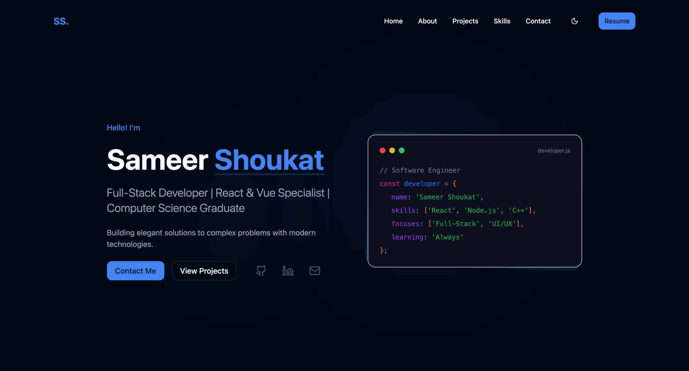

# 🚀 Sameer Shoukat – Full Stack Developer Portfolio

[](https://sameershoukat.dev)
[](https://github.com/Sameer447/portfolio)


[](LICENSE)

---



## ✨ Overview

Welcome to the personal portfolio of **Sameer Shoukat**, a dedicated Full Stack Developer with experience building production-level apps using **React**, **React Native**, and **Next.js**. This portfolio showcases my skills, projects, and achievements — crafted with modern web technologies and sleek design.

---

## 🎯 Features

- 📌 **Dynamic Content Sections** – About, Skills, Projects, Achievements, and Contact.
- 💡 **Responsive UI** – Optimized across mobile, tablet, and desktop screens.
- 🎨 **Theme Support** – Toggle between Light, Dark, and Purple themes.
- ✨ **Smooth Animations** – Powered by Framer Motion.
- ⚡ **Performance Focused** – Lazy loading with `react-lazy-load-image-component`.
- 📬 **Functional Contact Form** – Integrated with Web3Forms API.

---

## 🛠️ Tech Stack

| Category        | Tech Used                                      |
|----------------|------------------------------------------------|
| Frontend       | React (TypeScript), Vite                       |
| Styling        | Tailwind CSS, Custom & Radix UI Components     |
| State & Routing| React Query, React Router DOM                  |
| Animations     | Framer Motion                                  |
| Form Handling  | Web3Forms API                                  |
| Linting/Format | ESLint, Prettier                               |

---

## 📁 Project Structure
src/
├── components/ # Reusable UI components
├── pages/ # Page views (e.g., Home, 404)
├── hooks/ # Custom React hooks
├── data/ # Static config/data (e.g., skills, links)
├── styles/ # Tailwind CSS config
├── App.tsx # Root component
├── main.tsx # App entry point
└── index.css # Global styles

---

## ⚙️ Getting Started

> Run this project locally in a few simple steps:

### 🔧 Prerequisites

- Node.js v16+
- npm or yarn

### 🚀 Installation & Development

```bash
# Clone the repository
git clone https://github.com/Sameer447/portfolio.git
cd portfolio

# Install dependencies
npm install

# Start development server
npm run dev

npm run build      # Builds the project
npm run preview    # Serves the production build locally

npm run lint       # Lints your code with ESLint
